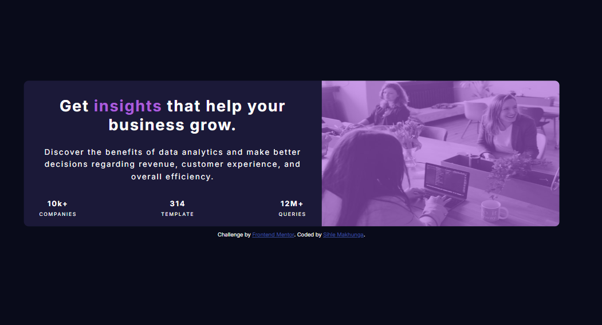

# Frontend Mentor - Stats preview card component solution

This is a solution to the [Stats preview card component challenge on Frontend Mentor](https://www.frontendmentor.io/challenges/stats-preview-card-component-8JqbgoU62). Frontend Mentor challenges help you improve your coding skills by building realistic projects. 

## Table of contents

- [Overview](#overview)
  - [The challenge](#the-challenge)
  - [Screenshot](#screenshot)
  - [Links](#links)
- [My process](#my-process)
  - [Built with](#built-with)
  - [What I learned](#what-i-learned)
  - [Continued development](#continued-development)
  - [Useful resources](#useful-resources)
  - [AI Collaboration](#ai-collaboration)
- [Author](#author)
- [Acknowledgments](#acknowledgments)

## Overview

### The challenge

Users should be able to:

- View the optimal layout depending on their device's screen size

### Screenshot



### Links

- Solution URL: [solution](https://www.frontendmentor.io/solutions/stats-preview-card-FD_wXLJBMu)
- Live Site URL: [live site](https://sihlemakhunga804-bot.github.io/Stats-Preview-Card-/)

## My process

The purpose of this project was to build a responsive preview card using HTML and CSS. The webpage displays an image, a heading, descriptive text, and company statistics in a modern card layout. HTML was used to structure the content, while CSS was used to style the webpage and make it visually appealing.

Step 1: Analyzing the Design

I began by studying the project design carefully. I identified the main components of the webpage, which included:

A hero image with a purple overlay.
A heading with highlighted text.
A short description paragraph.
Three statistics showing companies, templates, and queries.
A dark purple background.

Planning the layout before coding helped me understand how each section would fit together.

Step 2: Creating the HTML Structure

I created an index.html file and added the basic HTML5 structure. I then divided the webpage into sections using semantic HTML elements and <div> containers. I added:

An image section.
A content section.
A heading.
A paragraph describing the business insights.
Three statistic boxes displaying the company information.

This created a clear and organized webpage structure.

Step 3: Adding the CSS File

After creating the HTML structure, I created a style.css file and linked it to the HTML document using the <link> tag. Keeping the CSS separate from the HTML made the code easier to maintain and update.

Step 4: Styling the Background and Card

I used CSS to style the webpage by:

Setting a dark purple background for the page.
Creating a centered card container.
Applying background colours, spacing, and rounded corners.
Adjusting the width to match the design provided.

These styles gave the webpage a clean and modern appearance.

Step 5: Styling the Text

Next, I styled the typography by:

Choosing a modern font family.
Increasing the heading size.
Making the word "insights" purple to emphasize it.
Setting appropriate font sizes, colours, and line spacing for readability.
Styling the statistics with bold numbers and uppercase labels.
Step 6: Styling the Image

I inserted the image into the card and used CSS to:

Set the image width to fit the container.
Apply rounded corners to match the card.
Add a purple overlay effect using CSS so the image blended with the overall colour scheme.
Step 7: Positioning the Elements

I used CSS layout techniques such as Flexbox to align the content and ensure consistent spacing between the heading, paragraph, and statistics. Padding and margins were adjusted to create a balanced layout.

Step 8: Testing and Debugging

After completing the design, I tested the webpage in a web browser. I checked that:

The image displayed correctly.
The text was properly aligned.
The colours matched the design.
The spacing between elements was consistent.
The layout remained responsive on different screen sizes.

Any errors found during testing were corrected before finalizing the project.

Conclusion

This project improved my understanding of HTML and CSS by giving me practical experience in creating responsive layouts, styling text and images, using Flexbox for positioning, and applying colour schemes. I also learned the importance of planning, testing, and debugging to create a professional-looking webpage that closely matches a given design.

### Built with

- Semantic HTML5 markup
- CSS custom properties
- Flexbox
- Mobile-first workflow


### What I learned


To see how you can add code snippets, see below:

i have learnt that it is important to make a code more readable

```html
<div class="stat-num-and-description">
  <p class="stat-num"><b>314</b></p>
  <p class="description">TEMPLATE</p>
</div>
```

I also learnt on how to create different viewa for different device screen sizes


### Continued development

I wish to learn on how to us overflow code and opacity code which adjust transparency where it is applied


### Useful resources

-  resource 1 YOUTUBEwww.youtube.com/watch?v=qz0aGYrrlhU - this video helped me to build a proper readable structure for my coding in html and css styling
- Cisco Htmle Essentials - ( )This helped understand the concept of html and CSS styling


### AI Collaboration

Describe how you used AI tools (if any) during this project. This helps demonstrate your ability to work effectively with AI assistants.

- What tools did you use  ChatGPT,
- How did you use them (e.g., debugging, generating boilerplate, brainstorming solutions)?
- What worked well? What didn't?

I used chatgpt to help me find a code on how to make my picture to have a purple filter with this code,
.card-img::after {
    content: "";
    position: absolute;
    top: 0;
    left: 0;
    width: 100%;
    height: 100%;
    background-color: hsl(277, 64%, 61%);
    opacity: 0.6; /* adjust transparency */
    pointer-events: none; /* ensures overlay doesn’t block interactions */
}

I also used AI to help me create  a template of Desktop view and after I modified my desktopview to fit the preview card
```css
*{
    margin:0;
    padding:0;
    box-sizing:border-box;
}

body{
    font-family: 'Inter', sans-serif;
    background:hsl(233, 47%, 7%);
    display:flex;
    justify-content:center;
    align-items:center;
    min-height:100vh;
}

.card{
    width:1100px;
    height:450px;
    display:flex;
    background:hsl(244, 38%, 16%);
    border-radius:10px;
    overflow:hidden;
}

/* LEFT SIDE */

.content{
    flex:1;
    padding:70px;
    display:flex;
    flex-direction:column;
    justify-content:center;
}

.content h1{
    font-size:2.2rem;
    color:white;
    line-height:1.2;
    margin-bottom:30px;
}

.content h1 span{
    color:hsl(277, 64%, 61%);
}

.content p{
    color:hsla(0,0%,100%,0.75);
    line-height:1.8;
    max-width:380px;
    margin-bottom:70px;
}

/* STATS */

.stats{
    display:flex;
    gap:70px;
}

.stats h2{
    color:white;
    font-size:1.6rem;
    margin-bottom:8px;
}

.stats span{
    color:hsla(0,0%,100%,0.6);
    font-size:.8rem;
    letter-spacing:2px;
}

/* IMAGE */

.image{
    flex:1;
    position:relative;
}

.image img{
    width:100%;
    height:100%;
    object-fit:cover;
    display:block;
}

/* Purple overlay */

.image::after{
    content:"";
    position:absolute;
    inset:0;
    background:hsla(277,64%,61%,0.6);
}
```

## Author

- [@sihlemakhunga804-bot](https://www.frontendmentor.io/profile/sihlemakhunga804-bot)

## Acknowledgments

I would like thank xolani Dube for helping me undertsand how analyse and understand the requirements needed to finish the project. Nhlamulo Sibuyi helped upload my project on Github.

